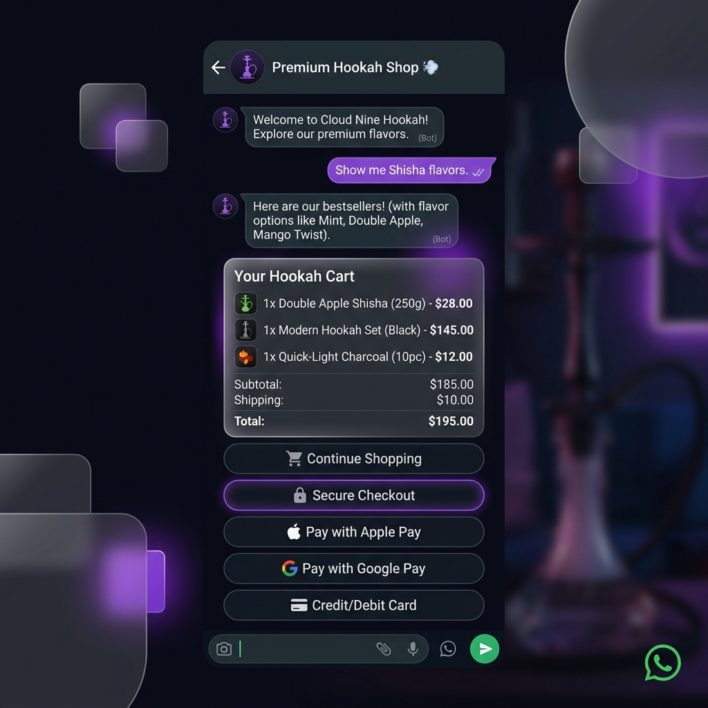
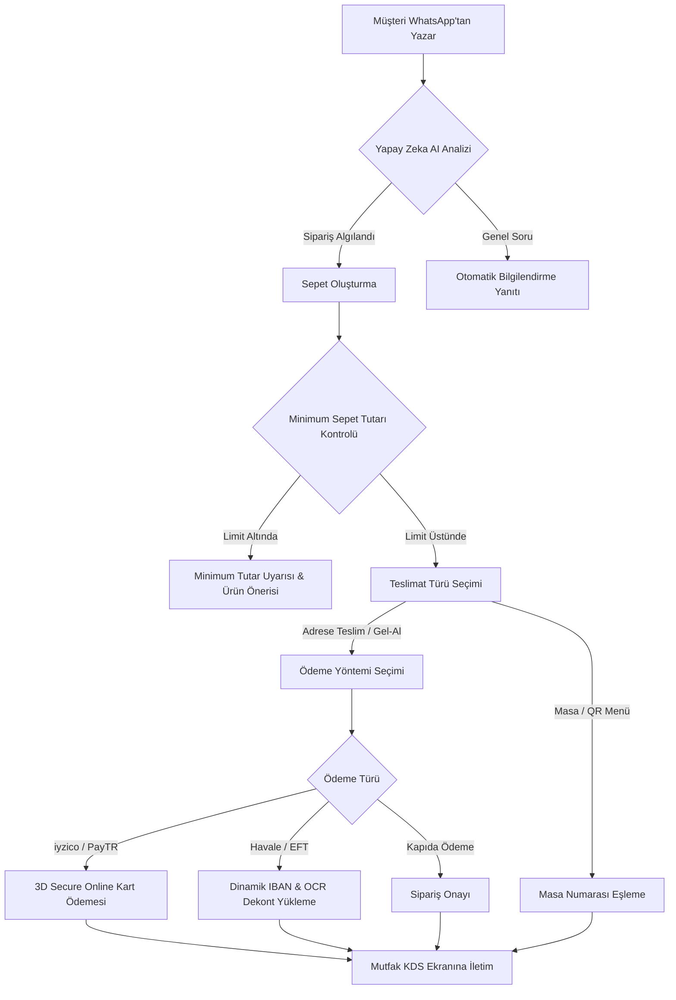
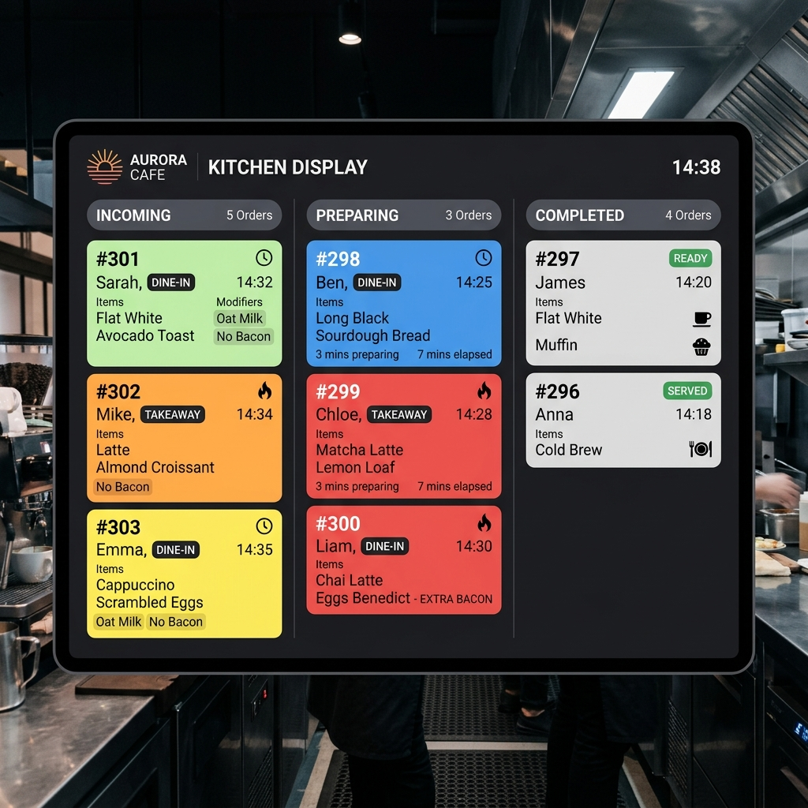
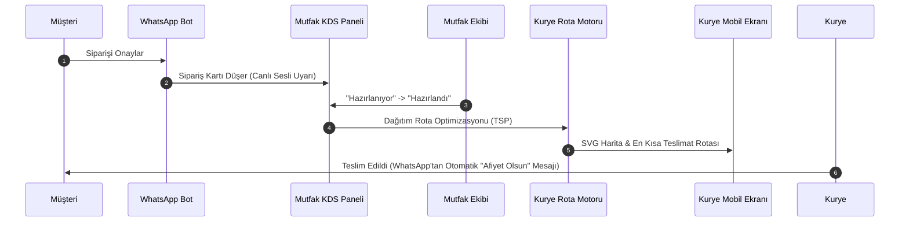
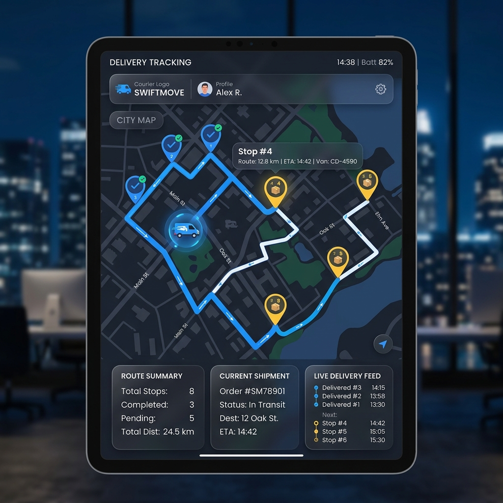

# Ceylan Nargile & WhatsApp Conversational Commerce Engine
## Dijitalleşme, Zaman Tasarrufu ve Akıllı Sipariş Yönetim Teklifi

Günümüz restoran, kafe ve nargile salonu işletmeciliğinde hız, müşteri memnuniyeti ve operasyonel verimlilik en kritik başarı faktörleridir. **Ceylan Nargile**'nin sipariş alma, hazırlama, ödeme ve kurye süreçlerini tamamen otomatikleştiren, **zamandan tasarruf etmenizi sağlayan ve sipariş kaçırma riskini sıfıra indiren** Conversational Commerce (Sohbete Dayalı Ticaret) sistemimizi gururla sunarız.

---

## 🚀 Sistemimizin Temel Değer Önerileri

> [!TIP]
> **Zamandan Tasarruf Edin:** Telefonla sipariş almak için dakikalarca konuşmaya veya WhatsApp mesajlarını manuel yanıtlamaya son! Yapay zeka destekli altyapımız siparişleri saniyeler içinde parse eder ve onaylar.
>
> **Sipariş Kaybını Engelleyin:** Aynı anda yüzlerce müşteriden gelen sipariş mesajları hiçbir personel müdahalesi gerektirmeden sıraya alınır ve mutfak ekranına (KDS) anında iletilir.
>
> **Gelişmiş Ödeme Altyapısı:** iyzico ve PayTR entegrasyonu sayesinde 3D Secure güvencesiyle online ödemeleri anında tahsil edin veya OCR dekont doğrulama sistemi ile havale süreçlerini otomatikleştirin.

---

## 🔄 1. Müşteri Sipariş Akışı (WhatsApp Chatbot)

Müşterileriniz hiçbir mobil uygulama indirmeden, sadece WhatsApp üzerinden Ceylan Nargile hattına yazarak siparişlerini verebilir. Sistem, yapay zeka ile müşterinin yazdığı doğal metinleri ayrıştırır, sepeti oluşturur ve ödeme adımına yönlendirir.

---

## 🍽️ 2. Mutfak / Operasyon Yönetimi (KDS & Kurye Paneli)

Siparişler onaylandığı an Ceylan Nargile yöneticilerinin ve mutfak personelinin önündeki **Mutfak Takip Ekranına (KDS)** düşer. Sistem, siparişin teslimat türüne göre (Masaya Servis, Paket Servis, Gel-Al) özel rozetlerle kartları renklendirir.

---

## 💳 3. Esnek ve Güvenli Ödeme Çözümleri

Ceylan Nargile'nin tahsilat süreçlerini hızlandırmak için geliştirilen hazır ödeme altyapımız:

| Ödeme Yöntemi | İşleyiş ve Özellikler | Ceylan Nargile'ye Faydası |
| :--- | :--- | :--- |
| **iyzico 3D Secure** | Kurumsal mavi temalı arayüz, SMS kod doğrulama (2 dakikalık sayaç). | Güvenli tahsilat, düşük komisyon oranları ve hızlı nakit akışı. |
| **PayTR 3D Secure** | Hızlı kart ödeme ve taksit seçenekleri entegrasyonu. | Alternatif ödeme kanalı ile kesintisiz tahsilat güvencesi. |
| **Havale / EFT (OCR)** | Dinamik IBAN listeleme ve dekont yükleme teyit sistemi. | Yönetici panelinde yapay zeka destekli dekont doğruluğu teyidi. |
| **Kapıda Ödeme** | Nakit veya POS Terminali seçimi. | İnternetten kartla ödeme yapmayı tercih etmeyen müşterilere erişim. |

---

## 🛠️ Ceylan Nargile İçin Yönetici Kolaylıkları

1. **Minimum Sepet Limiti Kontrolü:** Paket servislerinizde zarar etmemek için minimum sepet tutarı (örneğin 250 TL) belirleyebilirsiniz. Bu limitin altındaki siparişler engellenir ve müşteriye tamamlaması gereken tutar otomatik söylenir.
2. **Canlı Fiyat Uyuşmazlığı Alarmları:** Bot ile dijital menü arasında bir fiyat farkı oluştuğunda, yönetici panelinde anında **kırmızı uyarı kutusu** çıkar. Böylece hatalı fiyatla sipariş gitmesi engellenir.
3. **Desantralize Yetki Yönetimi:** Personellerinizi (Staff) ve Kuryelerinizi doğrudan kendi panelinizden tanımlayabilirsiniz. Her kuryeye özel profil ve araç plakası eşleştirilerek takip kolaylaşır.
4. **Çevrimdışı Akıllı Rota Sıralama (TSP):** Dış harita servislerine (Google Maps vb.) yüksek lisans ücretleri ödemenize gerek kalmadan, kuryenizin üzerindeki siparişler en verimli rota sırasına göre SVG harita üzerinde çizilir.

---

## 🎯 Sonuç: Ceylan Nargile Neden Bu Sistemi Seçmeli?

* **Sıfır Hata Payı:** WhatsApp botu sipariş kalemlerini, notları ve adresleri eksiksiz alır. İnsan hatasını ortadan kaldırır.
* **Personel Verimliliği:** Sipariş almak için telefona bakan personeliniz, artık salondaki müşterilerinizle ve nargile kalitesiyle ilgilenebilir.
* **Marka Prestiji:** WhatsApp üzerinden sipariş verebilen, 3D secure ile ödeme yapabilen ve siparişinin durumunu (hazırlanıyor, kuryede) WhatsApp'tan takip eden müşterileriniz için benzersiz bir premium deneyim sunarsınız.
